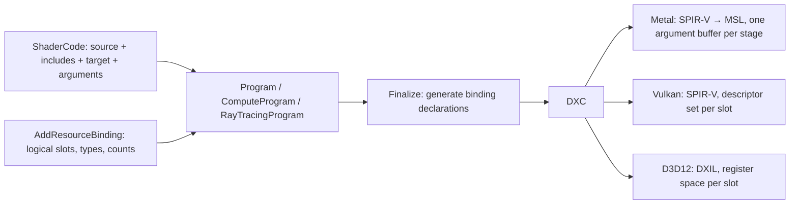

# ShaderCode and program resource bindings

## Problem and implemented design

A logical resource slot previously occupied one HLSL register space, one Vulkan descriptor set, and one Metal argument buffer. This couples portable HLSL declarations to the most restrictive resource-group limit. The installed SPIRV-Cross explicitly defines `kMaxArgumentBuffers = 8`; this is a translator constraint, not a universal statement about Metal hardware. The old backend check allowed 16 sets, which did not match that constraint. The legacy path now checks the translator limit and recommends `ShaderCode` when exceeded.

`ShaderCode` now owns a snapshot of HLSL source, its virtual filesystem (including includes), entry point, target profile, and compiler arguments. Programs copy that source when it is bound. `Finalize()` knows the complete resource layout, generates `RESOURCE_BINDING(slot, type, var_name)` definitions, and compiles the stage for the selected backend. Programs own the resulting native shaders. No `Program2` is necessary.



This change focuses on eliminating the Metal resource-group bottleneck. Vulkan and D3D12 keep their existing native descriptor layouts and device limits; it does **not** increase their supported slot counts or introduce descriptor indexing features. The HLSL source is shared; backend binding declarations are generated independently.

## API usage

```hlsl
struct Parameters { float4 scale; };
RESOURCE_BINDING(0, ConstantBuffer<Parameters>, parameters);
RESOURCE_BINDING(1, StructuredBuffer<float4>, inputs);
RESOURCE_BINDING(2, RWStructuredBuffer<float4>, output);

[numthreads(1, 1, 1)]
void Main() {
  output[0] = (inputs[0][0] + inputs[1][0]) * parameters.scale;
}
```

```cpp
using namespace grassland::graphics;
ShaderCode code(vfs, "main.hlsl", "Main", "cs_6_0");
std::unique_ptr<ComputeProgram> program;
core->CreateComputeProgram(code, &program);  // Copies source; no DXC compilation.
program->AddResourceBinding(RESOURCE_TYPE_UNIFORM_BUFFER, 1);          // Slot 0.
program->AddResourceBinding(RESOURCE_TYPE_STORAGE_BUFFER, 2);          // Slot 1.
program->AddResourceBinding(RESOURCE_TYPE_WRITABLE_STORAGE_BUFFER, 1); // Slot 2.
program->Finalize();  // Generates declarations, compiles, creates the native pipeline.

// CmdBindResources still accepts logical slots 0, 1, 2.
```

For graphics, call `program->BindShader(code, SHADER_TYPE_VERTEX/PIXEL/GEOMETRY)` where supported. For native ray tracing, use `AddRayGenShader(code)`, `AddMissShader(code)`, `AddHitGroup(closest_hit_code, any_hit_code_ptr, intersection_code_ptr, procedure)`, and `AddCallableShader(code)`. Explicit shader-table indices and registration order keep their existing meaning. Metal continues to expose ray queries through compute/graphics, not a native ray tracing pipeline.

A source string can also be passed directly to `ShaderCode(source, entry_point, target, args)`. The same source object can be reused with different programs and array counts. Each program compiles its own layout-specific shader; changing or destroying the original source/VFS does not affect it.

### Declaration rules

- `slot` is the zero-based `AddResourceBinding` registration index, or a preprocessor constant expanding to that index.
- `type` is the HLSL resource type, including its element type, e.g. `StructuredBuffer<float4>`. Use `ConstantBuffer<T>` for uniform buffers.
- `var_name` is the declared identifier. Add the trailing semicolon after the macro.
- Count 1 produces a scalar resource. Count greater than 1 generates a fixed resource array automatically. For an explicitly indexed one-element array, `var_name[1]` can be supplied when the configured count is 1. Do not append an array declarator when the configured count is greater than 1.
- HLSL's normal preprocessor rules apply; types containing unparenthesized commas need a suitable typedef or a struct element type.
- Resource types/counts must agree with shader use and command bindings. Counts must be positive; the existing acceleration-structure command interface binds one structure per slot.
- Undefined slots and invalid HLSL fail at `Finalize()`. Missing source files also produce an exception there. Binding declarations are prepended before the entry source, so included HLSL files see the same macros.
- The resource layout is frozen once deferred compilation starts. Create a new program for a different layout. Source recompilation/hot reload and a persistent cross-program shader cache are outside this change.

## Native mapping

For the three-slot example above:

| Logical slot | Resource count | Metal SPIR-V set/binding | Metal argument IDs | Vulkan set/binding | D3D12 register/space |
| --- | --- | --- | --- | --- | --- |
| 0, uniform buffer | 1 | 0 / 0 | 0 | 0 / 0 | b0 / space0 |
| 1, storage buffers | 2 | 0 / 1 | 1–2 | 1 / 0 | t0 / space1 |
| 2, writable buffer | 1 | 0 / 2 | 3 | 2 / 0 | u0 / space2 |

Metal definitions emit explicit `[[vk::binding(slot, 0)]]` annotations and non-overlapping HLSL registers. SPIRV-Cross maps each binding to an argument ID equal to the sum of all preceding resource counts. All active resources share native buffer index 0. Vertex input buffers still start at index 16.

At draw/dispatch, Metal allocates one argument-buffer snapshot per active stage, writes each logical resource at its generated argument ID, marks indirect resources for residency, and binds that buffer. Arrays, writable resources, samplers, and acceleration structures follow the same mapping. Only resources actually used by the compiled stage require binding. Native command buffers retain argument snapshots through execution; rebinding for a later dispatch does not overwrite an earlier dispatch's values.

## Compatibility

Existing `Core::CreateShader(...)`, `BindShader(Shader *, ...)`, `CreateComputeProgram(Shader *, ...)`, and ray tracing shader-pointer overloads remain available. Their HLSL declarations and native resource layout remain unchanged. Old Python shader-pointer bindings remain available as well; the new source API is C++ in this change.

A graphics program may mix an old compiled vertex shader with a new source pixel shader. Metal records the binding map **per stage**, so the legacy stage uses one argument buffer per slot while the source stage uses one packed buffer. Vulkan/D3D12 use the existing common layout for both stages.

Use macros for resource declarations in a `ShaderCode` stage. Existing handwritten `register(..., space...)` stages should continue through `CreateShader`; copying an arbitrary legacy stage into `ShaderCode` does not automatically rewrite its resource declarations. Migration can proceed stage by stage. No existing demos or Sparkium shaders are mass-converted by this PR.

## Validation report

Environment: Apple M5, macOS, CMake Ninja Release; Metal API and shader validation enabled for the Metal-only test run. Vulkan runtime testing uses MoltenVK on the same machine.

- New graphics binding suite: Metal-only **8 passed, 1 skipped**; combined Metal/Vulkan **10 passed, 2 skipped**. The skips are native ray tracing pipeline execution, unavailable on these devices/backends.
- Metal: **25 logical slots / 26 descriptors → 1 argument buffer**, including a two-element array followed by other slots. Two dispatches read back the expected sums **325** and **301** after rebinding, validating independent snapshots.
- Metal: one source compiled into two simultaneous programs with array counts 2 and 3; output argument IDs were 2 and 3, and switching back to the first program still returned **27**. Custom compiler arguments and source/include snapshot lifetime were exercised.
- Metal: ray query through a packed acceleration structure at argument ID 1 returned the expected triangle distance **2**.
- Metal and Vulkan: uniform buffers, sampled-image arrays, samplers, writable images, old compute shaders, and mixed old/new graphics stages were executed and checked by GPU readback.
- DXC: all seven resource categories compiled for Metal SPIR-V, Vulkan SPIR-V and D3D12 DXIL; raygen, miss, closest-hit, any-hit, intersection and callable entry points compiled to Vulkan SPIR-V and DXIL.
- Build: `demo_graphics_hello`, `demo_sparkium_gui`, and `demo_sparkium_cli` compile successfully with the unchanged shader-pointer API.
- Existing Sparkium/Metal regression suite: **24 passed, 3 skipped** (hardware image parity and two interactive window tests).
- Negative tests verify deferred syntax errors, missing source files, undefined resource slots, and frozen resource layouts.

D3D12 host C++ compilation and runtime execution require Windows and were **not run** on this machine. Native ray tracing pipeline execution also remains unverified locally; the test is enabled automatically on a backend/device that supports it. Successful DXIL compilation is not a substitute for either check.

Reproduce the focused checks:

```sh
cmake --build cmake-build-metal-only --target graphics_binding_test sparkium_fallback_test
MTL_DEBUG_LAYER=1 MTL_SHADER_VALIDATION=1 cmake-build-metal-only/test/graphics/graphics_binding_test
MTL_DEBUG_LAYER=1 MTL_SHADER_VALIDATION=1 cmake-build-metal-only/test/sparkium/sparkium_fallback_test
cmake --build cmake-build-metal --target graphics_binding_test
cmake-build-metal/test/graphics/graphics_binding_test
```
