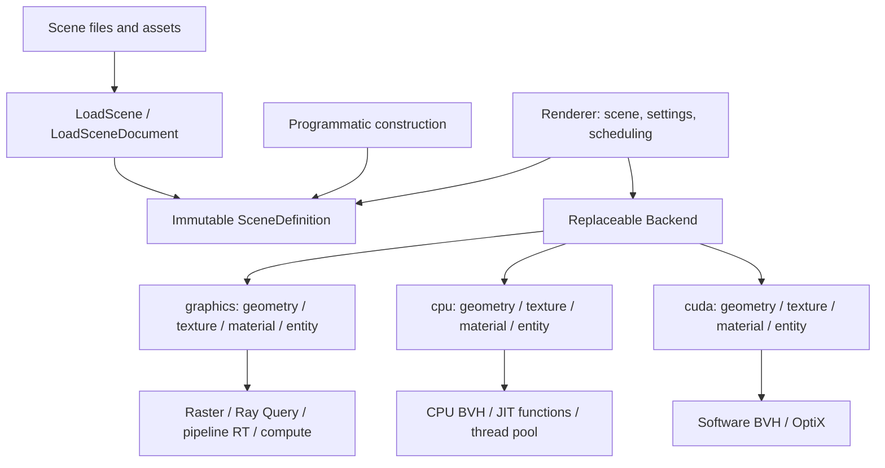

# Sparkium in-memory scene API

Sparkium separates scene loading, scene data and rendering. A scene can be loaded
without creating a device, then rendered by several backends without reading its
source files again. GUI, CLI and library clients use the same API.



## Loading and ownership

`LoadScene(path)` in `sparkium/scene_io/json_scene.h` resolves paths, reads meshes
and hair, decodes textures and returns `shared_ptr<const SceneDefinition>`. It
does not create a renderer, upload resources or compile shaders. Invalid files
and missing assets throw exceptions during loading. Material graph compilation
and backend capability checks occur when attaching/rendering the scene.

`SceneDefinition` contains camera, film and integrator definitions, material
parameters and node graphs, geometry, instances and lights. It contains no source
path, file handle, JSON document, graphics resource or backend object. Image-node
paths are replaced with references to decoded textures. Repeated texture paths
within one load share a single decoded image.

The loader is one producer of this data model. Applications can construct the
same model in memory without any scene file. File watching, source locations and
explicit reload actions belong to the caller's document management, not the
scene entity or renderer.

Publish a scene as an immutable snapshot while rendering. A renderer retains
shared ownership, so the caller may release its reference. To edit, copy the
definition and replace the changed values/assets, then call `SetScene` with the
new snapshot. Geometry and texture assets can remain shared. Do not mutate a
snapshot through another non-const alias while a renderer uses it.

## Library use

```cpp
#include <sparkium/scene_io/json_scene.h>
#include <sparkium/renderer/renderer.h>

sparkium::Renderer renderer;
renderer.SetScene(sparkium::LoadScene("scene.json"));
renderer.Configure({sparkium::RENDER_PIPELINE_AUTO, 64});
renderer.SetBackend({sparkium::RenderBackend::CPU});
renderer.Render();
auto cpu_image = renderer.ReadImage();

// Renderer and Scene survive; all backend resources are rebuilt from memory.
renderer.SetBackend({sparkium::RenderBackend::CUDA});
renderer.Render();
auto cuda_image = renderer.ReadImage();
renderer.ReleaseBackend(); // retains scene and settings
```

`ReadImage()` returns dimensions, accumulated sample count and owned RGBA8
pixels. `ReadLinearImage()` returns owned linear RGBA floats. Results remain
valid after renderer destruction. `Render()` completes the submitted work before
returning. `Reset()` clears accumulation. `Configure()` changes sampling/pipeline
settings and resets accumulation without reloading the scene.

`BeginProfile` / `EndProfile` preserve stage timings and the `frame_wall` CSV
field used by existing profiling scripts. The new CLI frame interval includes
host image readback through `ReadImage`; older CLI frame timings ended after
image development and excluded readback. Historical benchmark results keep their
original source commit and timing definition.

Use `RendererSettings::graphics_api` to select D3D12, Vulkan or Metal within the
Graphics family. OptiX is the CUDA hardware tracing path, not a separate family.
`SupportRenderer()` reports build availability; device initialization may still
fail if the machine lacks a compatible device or driver.

Calls on a renderer, including destruction, belong to its creating thread.
Independent renderers can run on separate threads with the same immutable scene.
Their accumulation, acceleration structures and resource caches are independent.

For programmatic construction:

```cpp
auto definition = std::make_shared<sparkium::SceneDefinition>();
definition->name = "Constant environment";
definition->film.width = 640;
definition->film.height = 360;
definition->camera.aspect = 640.0f / 360.0f;
definition->integrator.background_color = {0.1f, 0.2f, 0.3f};
definition->Validate();
std::shared_ptr<const sparkium::SceneDefinition> scene = definition;
renderer.SetScene(scene);
```

Link `sparkium_scene_io` for file loading and `sparkium_renderer` for rendering,
or use the existing aggregate `Sparkium` / `LongMarch` target. Loading does not
require the Graphics library. The scene model uses Grassland's host mesh/math
types; existing project-wide Python/CUDA math options still affect those targets.

## Backend lifecycle and pipeline capabilities

Default construction creates no device. `SetScene` and `Configure` can precede
`SetBackend`; `CreateRenderer(settings)` is a convenience for device creation.
`SetBackend` releases the old backend first and builds a new one from the retained
scene/settings. Accumulation starts over. If initialization or translation fails,
the renderer retains its scene/settings with no backend; fix settings and call
`SetBackend` again. Calls requiring a backend then report an error until recovery.
A backend cannot be replaced/released, or its scene changed, during profiling.

`SupportsPipeline` reports support on the initialized device. Explicit unsupported
requests throw; they do not silently choose another pipeline. `AUTO` selects
D3D12/Vulkan Ray Query when available, CUDA OptiX when available, otherwise the
backend's available tracing path. CPU supports `AUTO` and `RT_FALLBACK`.

`RenderBackend`, `GraphicsAPI`, `RenderPipeline` and their settings belong to
`renderer/`, not `scene/`. `SceneDefinition` has no pipeline field.
`LoadSceneDocument` returns `{scene, preferred_pipeline}` to preserve a scene
file's renderer preference separately. GUI/CLI use that preference when supported,
otherwise `AUTO`; an explicit user selection remains strict. `LoadScene` returns
only the independent scene entity. No file is reopened when switching backends.

## Backend implementation and CPU sharing

Renderer owns the scene snapshot, render settings and a replaceable `backend::Backend`.
Each backend implements scene translation, pipeline capability reporting, dispatch
and readback. `graphics/`, `cpu/` and `cuda/` each contain `geometry`, `texture`,
`material`, `entity`, `scene_objects` and `render_backend` implementations. Their
concrete object sets own execution resources and references to source semantics.
Each concrete `SceneObjects` translates its own scene, without a shared scene
controller or inheritance template. Each Backend directly implements the public
contract; there is no `ExecutionBackend` base. CPU and CUDA devices likewise
implement their own resource factories and submission, without `ComputeDevice`.

Backend implementations consume scene definitions and create private execution
objects. Graphics uploads textures/geometry and constructs graphics acceleration
structures. CUDA uploads data and constructs its software BVH or OptiX structures.
CPU texture bindings reference the original immutable pixel memory directly and
retain its owner. CPU BVH construction reads the original host mesh directly,
without a buffer upload/readback round trip.

The shared path tracer currently needs a packed geometry layout for shader
attribute access. That packed data is a backend-owned derived representation;
it does not replace or mutate the source mesh. Hair tessellation, BVHs, sampling
distributions, shader compilation and film accumulation likewise belong to
backend execution state. This is not a claim that every CPU operation is zero-copy.

Existing `Core`, `Scene`, `Film` and resource-level APIs remain for older
programmatic demos and the current pipeline implementation. They are not the new
scene data API. The backend-specific semantic object sets adapt the model to
these shared shader/resource bindings; neither `SceneDefinition` nor `Renderer`
exposes their Graphics types. The old `detail::SceneInstance` is removed.
Raster implementation is under `backend/graphics/raster`. Each backend owns
its own `path_tracing/` scene, pipeline state and dispatch implementation. CPU
has no Ray Query/OptiX pipeline option, Graphics has no CPU BVH/OptiX branch,
and CUDA has only software traversal and OptiX. CPU BVH construction is under
`backend/cpu`. There is no top-level `sparkium/pipelines` directory.
Each backend selects and dispatches its supported pipelines. The old combined `JsonScene::Load(Core*, path)` entry point is
removed: replace it with `LoadScene(path)` and `Renderer::SetScene(scene)`.

## Shared implementation boundary

`backend/common` contains reusable primitives: material shader text generation,
shader graph compilation, Slang support, the packed shader instance layout, and
low-level resource/binding ABI helpers. These helpers do not own a Scene, Backend
lifecycle or scene-rendering dispatch. There is no backend-enum dispatch in that
directory. Memory/shader ABI adapters can still support both host and CUDA storage;
that does not give them authority over scene preparation or pipeline selection.

The three backend implementations have separate CMake libraries. Their scene
translation, accumulation/readback, capability policy, resource factories and
path-tracing controllers are intentionally explicit. Shared HLSL algorithms and
pure material-code generation remain reused; backend lifecycle is not hidden
behind a common controller. The legacy Core entry point dispatches to these same
concrete implementations for compatibility with older demos.

## Frontends and validation

The CLI loads a scene before constructing a renderer. The GUI worker retains
the same Renderer and scene across backend/API switches, pipeline changes and resets.
Only selecting another document or explicitly requesting reload reads scene
files again. A failed reload does not invalidate the previously loaded snapshot.
Display still uses a separate Graphics device and consumes host image results.

Regression tests cover a loader-only executable, deleted source files with
external mesh and texture references, material image graphs, shared texture
identity, CPU borrowed-memory ownership, direct host-mesh BVH construction,
concurrent library rendering, per-renderer accumulation, and GUI switching/reload.
Backend rendering tests exercise the available Graphics, CPU and CUDA paths;
unavailable platform backends are not claimed as validated.

The [Renderer/Backend validation record](https://github.com/LazyJazzDev/LongMarchAssetsLFS/blob/1240cd16eff6cd30e15dfcf46cf22c55ba903809/reports/sparkium-native-backends/renderer-backend/README.md)
contains before/after images at 64 x 64 and 16 spp, 82 passing tests (one expected
skip), 31 CLI checks and executable provenance. Tests include retaining one
Renderer while switching backends after deleting all scene source files, failed
switch recovery, pipeline rejection and backend release without losing Scene.
All five tested paths retained identical PNG pixels; this is not a new
full-resolution Blender benchmark. The report was published through
[assets PR9](https://github.com/LazyJazzDev/LongMarchAssetsLFS/pull/9).
