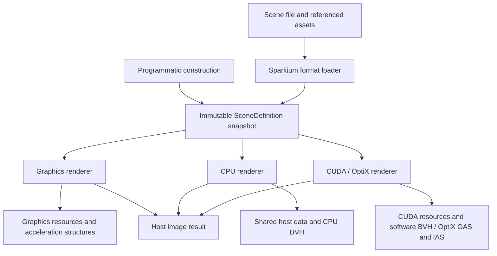

# Sparkium in-memory scene API

Sparkium separates scene loading, scene data and rendering. A scene can be loaded
without creating a device, then rendered by several backends without reading its
source files again. GUI, CLI and library clients use the same API.



## Loading and ownership

`LoadScene(path)` in `sparkium/scene_io/json_scene.h` resolves paths, reads meshes
and hair, decodes textures and returns `shared_ptr<const SceneDefinition>`. It
does not create a renderer, upload resources or compile shaders. Invalid files
and missing assets throw exceptions during loading. Material graph compilation
and backend capability checks occur when attaching/rendering the scene.

`SceneDefinition` contains camera, film and integrator definitions, material
parameters and node graphs, geometry, instances and lights. It contains no source
path, file handle, JSON document, graphics resource or backend object. Image-node
paths are replaced with references to decoded textures. Repeated texture paths
within one load share a single decoded image.

The loader is one producer of this data model. Applications can construct the
same model in memory without any scene file. File watching, source locations and
explicit reload actions belong to the caller's document management, not the
scene entity or renderer.

Publish a scene as an immutable snapshot while rendering. A renderer retains
shared ownership, so the caller may release its reference. To edit, copy the
definition and replace the changed values/assets, then call `SetScene` with the
new snapshot. Geometry and texture assets can remain shared. Do not mutate a
snapshot through another non-const alias while a renderer uses it.

## Library use

```cpp
#include <sparkium/scene_io/json_scene.h>
#include <sparkium/renderer/renderer.h>

auto scene = sparkium::LoadScene("scene.json");

auto cpu = sparkium::CreateRenderer({sparkium::RenderBackend::CPU});
cpu->SetScene(scene);
cpu->Configure({sparkium::RENDER_PIPELINE_RT_FALLBACK, 64});
cpu->Render();
auto cpu_image = cpu->ReadImage();

// No scene files or texture decoding are needed here.
auto cuda = sparkium::CreateRenderer({sparkium::RenderBackend::CUDA});
cuda->SetScene(scene);
cuda->Configure({sparkium::RENDER_PIPELINE_AUTO, 64});
cuda->Render();
auto cuda_image = cuda->ReadImage();
```

`ReadImage()` returns dimensions, accumulated sample count and owned RGBA8
pixels. `ReadLinearImage()` returns owned linear RGBA floats. Results remain
valid after renderer destruction. `Render()` completes the submitted work before
returning. `Reset()` clears accumulation. `Configure()` changes sampling/pipeline
settings and resets accumulation without reloading the scene.

`BeginProfile` / `EndProfile` preserve stage timings and the `frame_wall` CSV
field used by existing profiling scripts. The new CLI frame interval includes
host image readback through `ReadImage`; older CLI frame timings ended after
image development and excluded readback. Historical benchmark results keep their
original source commit and timing definition.

Use `RendererSettings::graphics_api` to select D3D12, Vulkan or Metal within the
Graphics family. OptiX is the CUDA hardware tracing path, not a separate family.
`SupportRenderer()` reports build availability; device initialization may still
fail if the machine lacks a compatible device or driver.

Calls on a renderer, including destruction, belong to its creating thread.
Independent renderers can run on separate threads with the same immutable scene.
Their accumulation, acceleration structures and resource caches are independent.

For programmatic construction:

```cpp
auto definition = std::make_shared<sparkium::SceneDefinition>();
definition->name = "Constant environment";
definition->film.width = 640;
definition->film.height = 360;
definition->camera.aspect = 640.0f / 360.0f;
definition->integrator.background_color = {0.1f, 0.2f, 0.3f};
definition->Validate();
std::shared_ptr<const sparkium::SceneDefinition> scene = definition;
renderer->SetScene(scene);
```

Link `sparkium_scene_io` for file loading and `sparkium_renderer` for rendering,
or use the existing aggregate `Sparkium` / `LongMarch` target. Loading does not
require the Graphics library. The scene model uses Grassland's host mesh/math
types; existing project-wide Python/CUDA math options still affect those targets.

## Backend implementation and CPU sharing

Renderer implementations consume scene definitions and create private execution
objects. Graphics uploads textures/geometry and constructs graphics acceleration
structures. CUDA uploads data and constructs its software BVH or OptiX structures.
CPU texture bindings reference the original immutable pixel memory directly and
retain its owner. CPU BVH construction reads the original host mesh directly,
without a buffer upload/readback round trip.

The shared path tracer currently needs a packed geometry layout for shader
attribute access. That packed data is a backend-owned derived representation;
it does not replace or mutate the source mesh. Hair tessellation, BVHs, sampling
distributions, shader compilation and film accumulation likewise belong to
backend execution state. This is not a claim that every CPU operation is zero-copy.

Existing `Core`, `Scene`, `Film` and resource-level APIs remain for older
programmatic demos and the current pipeline implementation. They are not the new
scene data API. `detail::SceneInstance` adapts the new model to these execution
objects internally; neither `SceneDefinition` nor `Renderer` exposes their
Graphics types. The old combined `JsonScene::Load(Core*, path)` entry point is
removed: replace it with `LoadScene(path)` and `Renderer::SetScene(scene)`.

## Frontends and validation

The CLI loads a scene before constructing a renderer. The GUI worker retains
the loaded scene across backend/API switches, pipeline changes and resets.
Only selecting another document or explicitly requesting reload reads scene
files again. A failed reload does not invalidate the previously loaded snapshot.
Display still uses a separate Graphics device and consumes host image results.

Regression tests cover a loader-only executable, deleted source files with
external mesh and texture references, material image graphs, shared texture
identity, CPU borrowed-memory ownership, direct host-mesh BVH construction,
concurrent library rendering, per-renderer accumulation, and GUI switching/reload.
Backend rendering tests exercise the available Graphics, CPU and CUDA paths;
unavailable platform backends are not claimed as validated.

The [illustrated validation record](../assets/reports/sparkium-native-backends/scene-api/README.md)
contains before/after images at 64 x 64 and 16 spp, test counts and provenance.
All five tested paths retained identical PNG pixels; this is not a new
full-resolution Blender benchmark.
